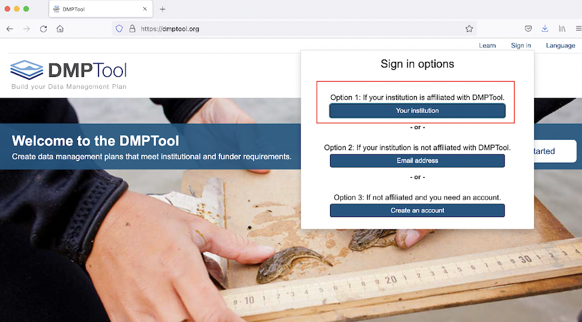
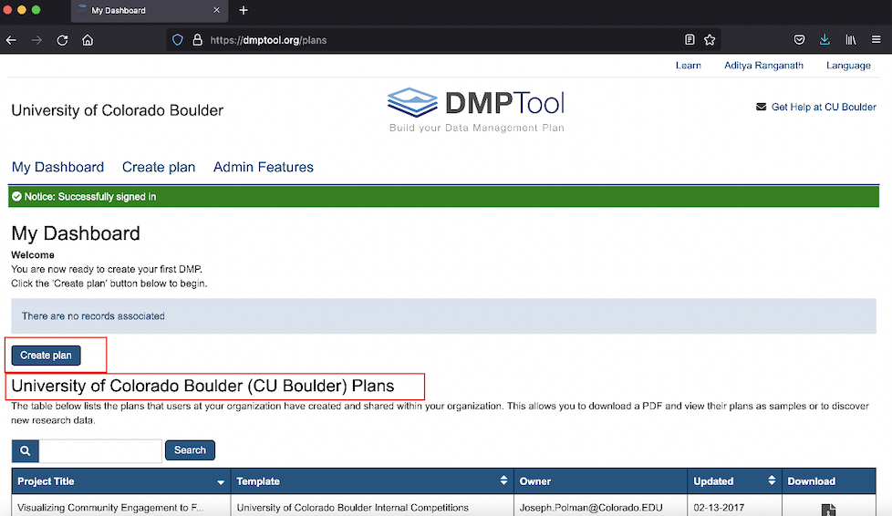
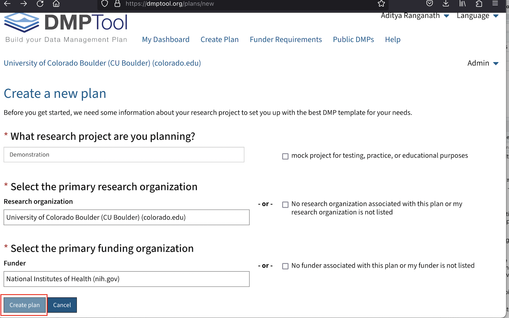
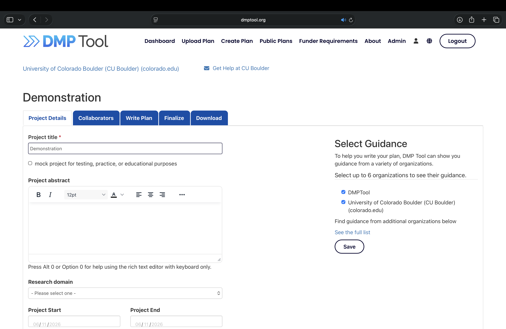

# Data Management and Sharing (DMS) Plans

One of the main requirements of the NIH Data Management and Sharing Policy is that grant applicants complete a Data Management and Sharing (DMS) Plan. You can familiarize yourself with the new plan template on the NIH's [dedicated DMS Plan page](https://grants.nih.gov/policy-and-compliance/policy-topics/sharing-policies/dms/writing-dms-plan), where you can download and review the template. For convenience, this template is also available for download [here](https://grants.nih.gov/sites/default/files/dms-blank-format-page-2026.docx). We also reproduce the questions from the template below. Note that many of the questions simply require a "yes/no" response.

1.  Will there be [maximum appropriate sharing of scientific data](https://grants.nih.gov/policy-and-compliance/policy-topics/sharing-policies/dms/writing-dms-plan#maximum-appropriate-sharing-of-scientific-data) underlying peer-reviewed publications and other findings resulting from the work supported by this award (including preprints, refereed papers reported at conferences, and other findings)? ***Y/N***

2.  Will the scientific data underlying peer-reviewed publications be shared by the time of publication, or for other findings, by the end of the period of performance, which includes no-cost extensions? ***Y/N***

3.  Will shared scientific data be made available for at least as long as required by applicable data repository policies and/or journal policies? ***Y/N***

4.  If you answered “no” to elements 1, 2, or 3, or if you anticipate that sharing will be limited in some other way, please describe these limitations and the ethical, legal, or technical factors for them. Your response should specify a particular reason(s) for limiting sharing. ***[300 words maximum]***

5.  If scientific data derived from human research participants will be shared, will privacy, rights, and confidentiality of participants be protected as outlined in [NOT-OD-22-213](https://grants.nih.gov/grants/guide/notice-files/NOT-OD-22-213.html)? ***Y/N***

6.  In the table below, please list [100 words maximum]

    a.  Key types of scientific data anticipated to be generated during the project, including the species and modality, if known (e.g., “human genomic data,” “rat functional magnetic resonance imaging data”). NIH recognizes that not all data types expected to be generated in the study will meet the definition of scientific data or can be anticipated in advance. If a data type does not appear on the list, it does not imply that that data type will not be shared if it is generated in the study.

    b.  The repository or an example of a repository where the scientific data may be managed and shared, if the scientific data is known at time of application. NIH expects the use of established repositories for preserving and sharing scientific data when they are available.

    | Expected Data Type | Established Repository or Example |
    |--------------------|----------------------------------:|
    | 6a                 |                                6b |

7.  For studies subject to the NIH Genomic Data Sharing Policy (GDS) (e.g., using NIH funds to generate large-scale human genomic data):

    a.  Will you share all large-scale human genomic and associated data in a NIH-designated repository according to the accelerated timelines expected in the GDS Policy? ***Yes/No/Not Applicable***

    b.  Do you anticipate that when sharing you will be able to meet the expectations of the Institutional Certification in the GDS Policy? ***Yes/No/Not Applicable; if "no", address in element 4***

You can also access the NIH DMS Plan template, and complete your Plan on [DMPTool](dmptool.org), which is a digital platform that provides structured assistance to researchers that would like to craft data management plans. *DMPTool* provides data management plan templates for a variety of major funders, including NIH. A particularly helpful feature of *DMPTool* is that it allows for easy collaboration among project teams, including among project teams that are dispersed across multiple institutions.

To get started with *DMPTool*, you can sign in using your CU credentials/Identikey:

```{r, echo=FALSE, fig.cap="Sign into DMPTool via your institution"}

```

Once you've signed in, you will arrive at a page displaying your *DMPTool* dashboard. To start a new plan, go ahead and click the blue "Create Plan" button:

```{r, echo=FALSE, fig.cap="Your personal DMPTool dashboard"}

```

Note that once you start working on a plan, you can save in-progress plans and return to them at your convenience; in-progress plans will show up on this dashboard.

After you have clicked the "Create Plan" button, you will arrive at an interface like the one below, where you can provide relevant details about your project, such as its name, the funding organization, and the plan template that you would like to use. In this example, we've named our project "Demonstration", and have selected "National Institutes of Health" as the funding organization. Because there is only one NIH DMS Plan template, we do not need to explicitly select a template (as we would for a funding agency with multiple templates, such as the NSF); selecting "National Institutes of Health" as the funding organization will automatically load the NIH template once you select "Create plan":

```{r, echo=FALSE, fig.cap="Initiate a new plan"}

```

At this point, we are on a page that looks something like the one below:

```{r, fig.cap="Environment to assemble plan", echo=FALSE}

```

You can find the actual plan template by clicking on the blue "Write Plan" tab, but you can also add relevant project details and information about collaborators by clicking on the tabs that correspond to those topics. Once you have filled out the sections in the Plan template, you can download a PDF copy of the Plan (which can be submitted as part of your grant application) within the "Download" tab.

Before moving on, it is important to emphasize that when NIH refers to "sharing scientific data" in its DMS Plan template and policy documents, the expectation is that data will be published in a dedicated third-party data repository; it is generally not acceptable to self-host data, or indicate that it will be shared upon request. For additional general information about data repositories, and CU Scholar (our campus's institutional repository), please see [Section 4][Repositories for Data Sharing] below.

# Data Management Best Practices and Tools

Once you are awarded an NIH grant and your project gets underway, it is important to implement data management best practices, which will ultimately help you to fulfill data deposit requirements at the end of the project in an efficient manner, as well as improve the quality of your published data. To that end, the subsections below discuss some useful data management resources and strategies to consider.

## Data Storage

In your data management and sharing plan, you should expect to discuss where and how research data will be stored while your project is ongoing (data storage during an active project is distinct from data archiving for long-term preservation and reuse, which you should also discuss in your Plan; for more on fulfilling this requirement, see Sections 6 and 7 below). Once the project is actually underway, you will need to store data using the active storage plan presented in your DMS Plan.

OIT has put together a [helpful guide to data storage options at CU Boulder](https://oit.colorado.edu/services/file-transfer-storage-infrastructure):

-   In most cases, especially if your research data is expected to be less than one Terabyte, OneDrive is probably the best storage option for research data. OneDrive has been approved by OIT for the storage of highly confidential data, and is considered a secure storage environment.
-   If you are working in the realm of "big data", and need more than one terabyte of storage space, the CU Boulder [PetaLibrary](https://www.colorado.edu/rc/resources/petalibrary) is an option that is worth exploring. While you can store data \>1 terabyte on the PetaLibrary, note that unlike OneDrive, storing your data in the PetaLibrary involves an out-of-pocket cost (\$45/terabyte/year), and is not approved for the storage of sensitive or highly confidential data.
-   If you need a secure way to transfer large amounts of data between project team members, CU Boulder's free [Large File Transfer Service](https://oit.colorado.edu/services/file-transfer-storage-infrastructure/large-file-transfer) is a useful resource.

A general principle of data storage and security to keep in mind is the ["3-2-1" rule](https://libguides.princeton.edu/c.php?g=102546&p=665865): Keep *3* copies of important data (1 original record, and 2 copies), on *2* different storage environments, with at least *1* copy held physically off-site or in a secure cloud storage environment.

## Data Management Best Practices

The NIH has assembled an extremely useful guide to [data management best practices for active projects](https://sharing.nih.gov/data-management-and-sharing-policy/data-management). Two topics mentioned in that guide are worth emphasizing:

-   **Documentation and Metadata**: Documenting your data workflows as you carry out your research will make it easier to prepare your data for long-term archiving at the end of your project. For guidance on best practices for data documentation and metadata, this document (from MIT) is a good place to start: [https://libraries.mit.edu/data-management/store/documentation](https://libraries.mit.edu/data-management/store/documentation/). Cornell University Libraries' brief [primer on standards-based metadata](https://data.research.cornell.edu/content/writing-metadata) is also helpful. When you deposit your data in a repository for long term preservation, it is usually a minimal requirement that you at least provide ["readme" style metadata](https://data.research.cornell.edu/content/readme). We recommend that you review the sort of information that is typically presented in a data readme file, and document your ongoing work with a view towards creating such a metadata file at the conclusion of your project.
-   **File management**: Data files and directories can quickly proliferate over the course of a project, and it’s important to have a framework in place that regulates how files and directories are named, organized, and versioned. For a useful primer on file naming and organization conventions, see this [resource from the University of Wisconsin](https://researchdata.wisc.edu/file-naming-and-versioning/).

## Data Management Tools

There are a variety of tools that can help you to implement data management best practices. There are too many to catalog here, but a few are worth highlighting:

-   **The Unix Shell/Command Line**: When creating, naming, deleting, or moving around files and directories, it is easier to keep track of everything if you implement these tasks programmatically (rather than pointing and clicking in a graphical user interface). The Unix Shell is a basic scripting tool that allows you to automate these aspects of file management relatively easily; this makes file management quicker, less error-prone, and easier to document. For an excellent tutorial on using the Unix shell for file management, see this lesson from the [Carpentries](https://carpentries.org) program: <https://swcarpentry.github.io/shell-novice/>.
-   **Git and GitHub**: Version control is an important part of data management that refers to your approach to tracking changes made to files containing data and code over time. Git is a version control system widely used in the open-source software and academic research communities. GitHub is a platform for hosting projects and source code that is based on Git; it’s a great way to implement versioning in a collaborative project. GitHub is a particularly useful way to store and keep track of changes in the code and scripts you use to process your data. Ultimately, these scripts can also be submitted alongside your datasets for long-term preservation in data repositories. To get started with Git and GitHub, this lesson is a good place to start: <https://swcarpentry.github.io/git-novice/>.
-   **Open Science Framework**: The [Open Science Framework (OSF)](https://osf.io) is designed to be a one-stop shop for all of your data and project management needs. It integrates various data storage, analysis, versioning, and management applications into one unified platform.

# Repositories for Data Sharing {#repositories1}

The second explicit requirement associated with the new NIH Data Management and Sharing Policy (in addition to the Data Management and Sharing Plan requirement we discussed above) is that at the conclusion of your project, you must share your project data by publishing it in a third party facing data repository in accordance with your DMS Plan commitments.

A data repository is essentially a digital archive that is designed to preserve research data beyond the life of a given project, so that other researchers can easily reuse and build on previous research and data collection efforts. More generally, data repositories have the goal of making research data [FAIR](https://www.nature.com/articles/sdata201618): **F**indable, **A**ccessible, **I**nteroperable, and **R**eusable. It is worth reiterating that hosting your data on a personal website is not considered an acceptable alternative to sharing data via a FAIR-aligned third party data repository.

## The Landscape of Data Repositories

There are three general types of data repositories within the broader repository ecosystem:

-   **General purpose repositories** accept data deposits from researchers from various disciplines, regardless of their institutional affiliation. An example of a general purpose repository is the [Harvard Dataverse](https://dataverse.harvard.edu).
-   **Disciplinary repositories** accept deposits from researchers from designated discipline(s) or research communities, regardless of their institutional affiliation. An example of a disciplinary or community-based repository is the [Inter-university Consortium for Social and Political Research (ICPSR)](https://www.icpsr.umich.edu/web/pages/), which hosts data from social science researchers (including public health data)
-   **Institutional repositories** accept data deposits from researchers who are members of a specific institution, regardless of their discipline or area of research. An example of an institutional repository is [CU Scholar](https://scholar.colorado.edu), which is CU-Boulder's own institutional repository.

Within these broad categorical distinctions, there are additional policy and resource-based differences across repositories. For example, there is considerable variation in the size of the data deposits that repositories are able to accept. To take another example, some repositories only host open access data, while others give researchers the option to deposit restricted-use data that potential users must apply to access (which is a useful way to meet NIH data sharing requirements in the context of sensitive human subjects data that would not be appropriate for public release on an open access basis).

For certain grants, NIH may mandate the use of certain repositories, but in general, researchers are given the flexibility to use the repository of their choice. Given the diversity of the data repository landscape, it can be challenging to decide on an appropriate repository (or repositories) to deposit data in order to fulfill NIH data sharing requirements. This [guide to selecting a data repository](https://sharing.nih.gov/data-management-and-sharing-policy/sharing-scientific-data/selecting-a-data-repository) from the NIH is a useful starting point for thinking about possible repository destinations for your research data. The NIH has also provided a [catalog of repositories](https://www.nlm.nih.gov/NIHbmic/nih_data_sharing_repositories.html) that might give you some more specific ideas about repository options. If you would like more tailored guidance about potential repository destinations appropriate to your project needs, [we also encourage you to contact CRDDS for a consultation][Conclusion and Further Reading].

## CU Scholar and Repository Services at CU Boulder

[CU Scholar](https://scholar.colorado.edu) is CU Boulder's institutional repository. You can use CU Scholar to publish your research data, and thereby fulfill NIH data sharing requirements. CU Scholar is a popular venue for CU-affiliated researchers looking to publish their research data, since it is supported by CRDDS staff, who help coordinate the publication process. In addition, CU Scholar has been certified by [CoreTrustSeal](https://www.coretrustseal.org), which is seen by grant reviewers and members of the scholarly communications community as a credible signal of a repository's overall quality. If you are interested in publishing your NIH project data on CU Scholar, the subsections below offer a brief overview of repository practices and policies.

### Basic CU Scholar Policies

If you are thinking of depositing your data in CU Scholar, please review the [Data Set Policy](https://scholar.colorado.edu/terms) (scroll all the way down). Two things, in particular, are worth emphasizing:

-   All of the contributors to a dataset or project do not necessarily have to be affiliated with CU-Boulder, but the person who deposits the data must be employed by CU-Boulder (the depositor must authenticate with CU-Boulder credentials).
-   Once the data is published, it is immediately open-access and accessible to anyone who wishes to view or download the data. As a result, datasets with personally identifying information are not appropriate for CU Scholar.

### Submitting data to CU Scholar

If you decide that you would like to meet NIH data sharing requirements using CU Scholar, please consult the [submission guidelines](https://scholar.colorado.edu/about), for an overview of the submission process.

The basic steps of the CU Scholar data submission workflow are as follows:

1.  Click the blue "Share Your Work" button on the [main CU Scholar page](https://scholar.colorado.edu).
2.  When prompted to select the type of work, select the "Data Set" option.
3.  You will be prompted to fill out several fields, and upload your data. Please also upload a Readme or documentation file that provides relevant metadata. You can use the suggested [Readme template for CU Scholar](https://drive.google.com/file/d/1h_iBgq3HY0yXyJXDwWpi80GMC2Z4fO9U/view) for this purpose.
4.  Once you have completed the submission, we will review it for adherence to [FAIR data principles](https://www.nature.com/articles/sdata201618). We may recommend changes to your submission based on this review.
5.  Once the submission has been finalized, we will register a digital object identifer (DOI) for the data, which can be used to uniquely identify the dataset. You can share this DOI link with relevant stakeholders, which provides proof of compliance with the NIH data publication requirement.

### Sample CU Scholar datasets

If you would like to see what dataset publications look like on CU Scholar, here are a few recent examples:

-   <https://doi.org/10.25810/mzt8-w960>
-   <https://doi.org/10.25810/y1f2-j085>

### CU Scholar size constraints and costs

If your data submission is less than 500 GB, we can publish it on CU Scholar at no additional cost to you.

For data submissions greater than 500 GB, there is a one-time data deposit fee of \$450/terabyte. When assessing costs, file sizes are always rounded up (for example, a deposit of 750 GB will be assessed a deposit fee of \$450; a deposit of 1.4 TB will be assessed a deposit fee of \$900; and so on).

### Privacy, Ethics, and CU Scholar

As we noted above, all data on CU Scholar is open data; if you decide to use CU Scholar to meet data publication requirements, please make sure that the data is appropriately de-identified or anonymized to protect human subjects. We can offer some advice on de-identification, but the responsibility for ensuring that the data is appropriate for public dissemination, and that human subjects are protected, ultimately rests with the depositor. For practical guidance on data anonymization, please see this resource from the [UK Anonymization Network](https://ukanon.net/framework/).

As noted above, an alternative to anonymization is to deposit your data with a repository that has an infrastructure the supports the deposit of restricted-use data. If a repository has a restricted-use option, you will be able to deposit your data just as you would deposit data in a normal open-access repository, but the repository will only make the data available to researchers under controlled conditions that guarantee the safety of human subjects. For an example of how restricted-use data policies generally work, see this [overview of restricted use data policies at ICPSR](https://www.icpsr.umich.edu/web/pages/ICPSR/access/restricted/).

# Conclusion and Further Reading

The goal of this primer was to provide a concise overview of the NIH's Data Management and Sharing Policy, and offer general guidance on resources that will help you to fulfill Policy requirements. However, it is important to emphasize that every project is unique, and if you have specific questions about how to navigate the DMSP in the context of your own work, we encourage you to contact CRDDS for a consultation. CRDDS staff are available at regularly scheduled consult hours during the academic year (see the [CRDDS Events Page](https://www.colorado.edu/crdds/events) for more information), and by appointment (please email [crdds\@colorado.edu](mailto:crdds@colorado.edu)).

In addition to consultations, CRDDS regularly provides workshops and educational offerings related to data management (including workshops on some of the tools and best practices mentioned above), which you can also find on the CRDDS Events page.

## References

The following resources and references were mentioned earlier; they are reprinted below.

**Basic Policy Guidelines**

-   [NIH's new Data Management and Sharing Policy (DMSP) Overview](https://sharing.nih.gov/data-management-and-sharing-policy)
    -   [NIH Data Management Planning](https://sharing.nih.gov/data-management-and-sharing-policy)
    -   [NIH Data Management Best Practices](https://sharing.nih.gov/data-management-and-sharing-policy/data-management)
    -   [NIH Data Sharing and Archiving Expectations](https://sharing.nih.gov/data-management-and-sharing-policy/sharing-scientific-data)

**Data Storage**

-   [OIT Guide to data storage at CU Boulder](https://oit.colorado.edu/services/file-transfer-storage-infrastructure)
    -   [CU Boulder PetaLibrary](https://www.colorado.edu/rc/resources/petalibrary)
    -   [Large File Transfer](https://oit.colorado.edu/services/file-transfer-storage-infrastructure/large-file-transfer)
-   [Back-ups and the 3-2-1 Rule](https://libguides.princeton.edu/c.php?g=102546&p=665865)

**Data Management Best Practices**

-   Documentation and Metadata
    -   [Basic metadata guidance](https://libraries.mit.edu/data-management/store/documentation/)
    -   [Standards based metadata](https://data.research.cornell.edu/content/writing-metadata)
    -   [Readme-style metadata](https://data.research.cornell.edu/content/readme)
    -   [CU Scholar Readme Template](https://drive.google.com/file/d/1h_iBgq3HY0yXyJXDwWpi80GMC2Z4fO9U/view)
-   [File Management Best Practices](https://researchdata.wisc.edu/file-naming-and-versioning/)

**Data Management Tools and Resources**

-   [Command line tutorial](https://swcarpentry.github.io/shell-novice/)
-   [Git and GitHub tutorial](https://swcarpentry.github.io/git-novice/)
-   [Open Science Framework](https://osf.io)

**Data Repositories and Publishing**

-   [FAIR Data Principles](https://www.nature.com/articles/sdata201618)
-   [Catalog of repositories provided by NIH](https://www.nlm.nih.gov/NIHbmic/nih_data_sharing_repositories.html)
-   [CU Scholar](https://www.nlm.nih.gov/NIHbmic/nih_data_sharing_repositories.html)
    -   [CU Scholar submission guidelines](https://scholar.colorado.edu/about)
    -   [CU Scholar data set policy](https://scholar.colorado.edu/terms) (scroll to bottom)
    -   [Sample CU Scholar Dataset 1](https://doi.org/10.25810/mzt8-w960)
    -   [Sample CU Scholar Dataset 2](https://doi.org/10.25810/y1f2-j085)
-   Data Publishing and Privacy for Human Subjects
    -   [UK Anonymization Network](https://ukanon.net/framework/)
    -   [ICPSR Restricted Use Data Policy](https://www.icpsr.umich.edu/web/pages/ICPSR/access/restricted/)

## Additional resources and further reading

The resources below were not previously mentioned in the primer, but are worth consulting if you are looking for additional guidance or context.

-   As you navigate the NIH DMS Plan requirements, this [glossary of relevant terms](https://osf.io/p68s2) can come in handy.
-   This [Guide to Social Science Data Preparation and Archiving](https://www.icpsr.umich.edu/files/deposit/dataprep.pdf) is written for a social science audience, but presents data management fundamentals that are of broader interest, and which are relevant to the NIH DMSP.
