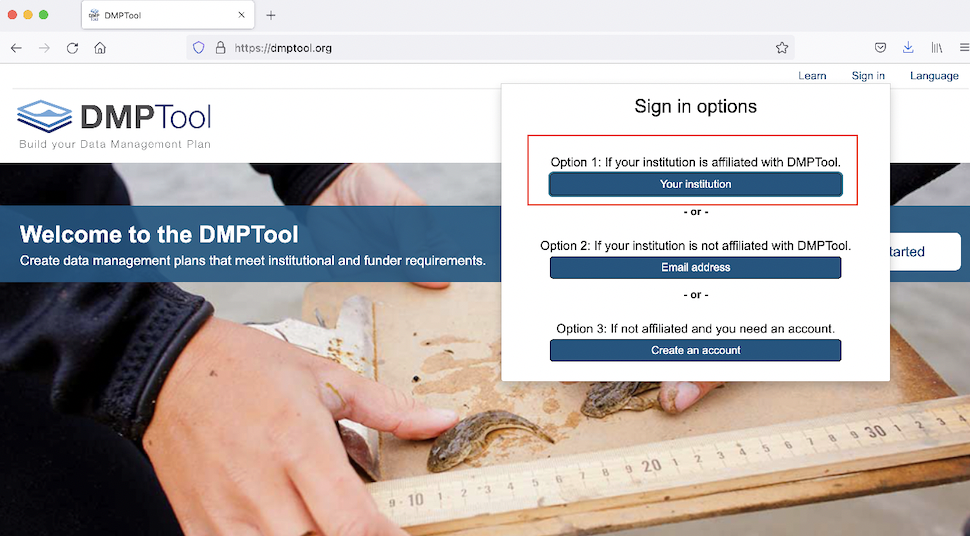
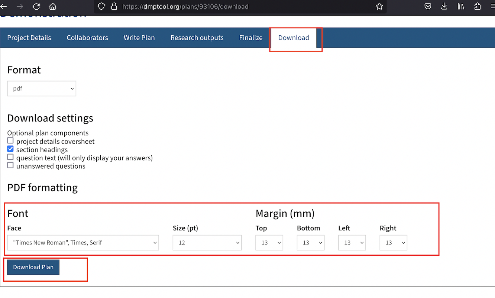
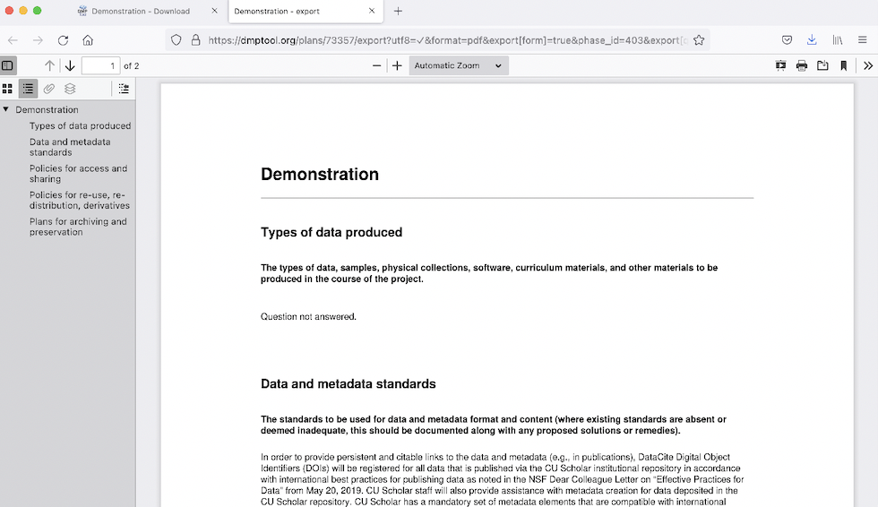
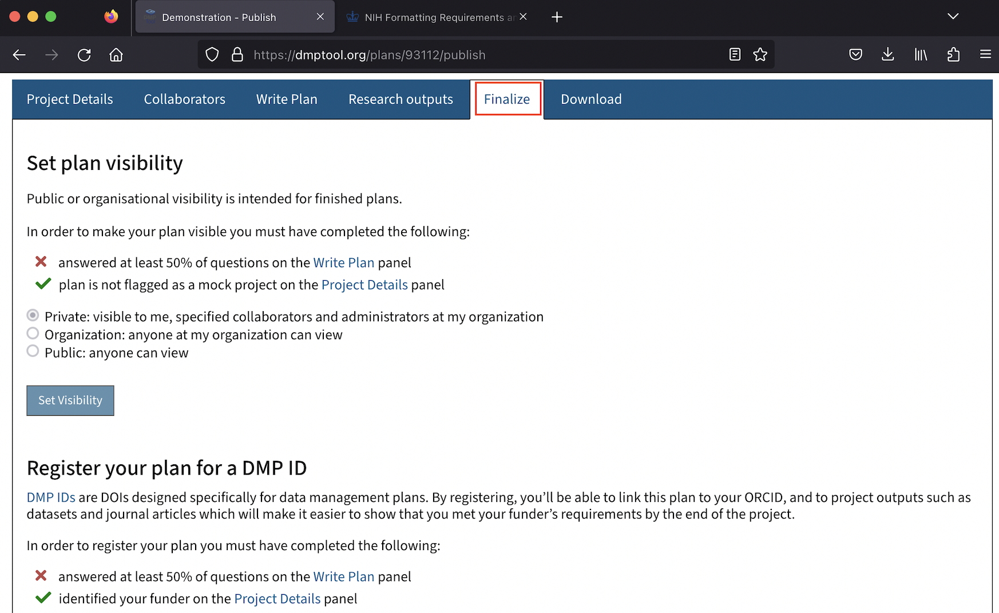

# (PART) Data Management Planning {-}

# An Overview of Data Management Planning

A data management and sharing plan (DMS plan) is a short document (~2 pages) that describes your plans for collecting, organizing, storing, and eventually disseminating the data that underlies your published research. Writing a DMS plan gives you the opportunity to develop a framework for organizing and managing your research data over the lifecycle of the project; putting it in writing helps you to think through various issues that might arise, and approach data management in a deliberate and intentional way, rather than figuring things out as you go in an ad-hoc fashion. Ultimately, this increases the likelihood that research data products will be reusable and reproducible. 

Data management and sharing plans are therefore increasingly required by funding agencies as a part of grant applications, and have been a requirement for NSF grant applications for some time now. One of the key features of the NIH's new DMSP is that a data management and sharing plan will now be a requirement for NIH grants as well.

The final draft of the template for the NIH data management and sharing plan is still in development, and will be released soon. However, the basic outline has already been [published on the NIH website](https://sharing.nih.gov/data-management-and-sharing-policy/planning-and-budgeting-for-data-management-and-sharing/writing-a-data-management-and-sharing-plan), and you can review it there. If you are familiar with NSF data management plans, you'll notice that the NIH draft DMS plan template is quite similar.

If you are planning to apply for an NIH grant, the easiest way to generate an appropriate data management and sharing plan that conforms to NIH requirements is to use an application called [*DMPTool*](https://dmptool.org/). [*DMPTool*](https://dmptool.org/) is a digital platform that provides structured assistance to researchers that would like to craft a data management and sharing plan. It allows you to view sample plans that have been completed in the past, and develop new data management and sharing plans using templates that correspond to the requirements of the major funding agencies. It also allows for easy collaboration among project teams, including among project teams that are dispersed across multiple institutions.

The NIH data management and sharing plan template has not yet been added to *DMPTool*, but will be included by the time the new NIH DMSP goes into effect in early 2023. Below, Section 3 walks you through the main steps involved in creating a data management and sharing plan using *DMPTool*. Because the NIH template has not yet been added, the example uses a sample NSF template; note, however, that the workflow will be substantively quite similar for the NIH template (once it's added). 

# Using *DMPTool*

## Log into your *DMPTool* account and view your personal dashboard

Go to the [*DMPTool*](https://dmptool.org) website, and select the option to sign in via the institutional portal:

```{r, echo=FALSE, fig.cap="Sign into DMPTool via your institution"}

```

Then, select University of Colorado, Boulder; once you click **Go**, you will be able to sign in via your Identikey:

```{r, echo=FALSE, fig.cap="Look up CU Boulder and click 'Go' to sign in via IdentiKey"}
knitr::include_graphics("images/pic2.png")
```

This will bring you to your personal *DMPTool* Dashboard. Here, you can begin a new plan; resume working on a saved plan (in-progress plans will show up under the **My Dashboard** sign if they exist); or view sample plans created by other CU researchers (under the banner that reads **University of Colorado Boulder Plans**)

```{r, echo=FALSE, fig.cap="Your personal DMPTool dashboard"}
knitr::include_graphics("images/pic3.png")
```

## Create a new plan

To initiate a new plan, click the blue **Create plan** button (see Figure 3.3), which will bring you to an interface like the one below: 

```{r, echo=FALSE, fig.cap="Initiate a new plan"}
knitr::include_graphics("images/pic4.png")
```

Here, you can provide relevant details about your project, such as its name, the funding organization, and the plan template that you would like to use. In this example, we've named our project "Demonstration", and have selected "NSF" and the generic NSF plan template ("NSF-GEN: Generic") under the **Funder** and **Template** headings (but, if you'd like to prepare a data management and sharing plan for an NIH grant, you would select the "NIH" option once it is available in *DMPTool* in early 2023). Once you've filled out this information, go ahead and click the blue **Create plan** button, as in Figure 3.4. 

## Customize, Write, and Compile the Data Management and Sharing Plan

At this point, we are on a page that looks something like the one below. Note the six tabs running along the top of the page:

```{r, fig.cap="Environment to assemble plan", echo=FALSE}
knitr::include_graphics("images/pic5.png")
```

By systematically working through the various sections associated with these tabs, you will be able to generate a data management and sharing plan. Make sure to save your work on the sections as you go. 

Also, note the **Select Guidance**  section on the right. Make sure that both the **DMPTool** and **University of Colorado Boulder (CU Boulder)** buttons are selected. This ensures that as you work through the material within the **Write Plan** tab, you will be able to see relevant guidance on how to complete various sections of your DMS plan 

In the first tab, **Project Details**, you can enter your project abstract and some additional information. The second tab, **Collaborators**, will look like the image below; here, you can invite collaborators to participate in creating the DMS plan, and regulate their access to the in-progress document.

```{r, echo=FALSE, fig.cap="Add collaborators"}

```

Once you've invited collaborators (if relevant) and set their permissions, you can click the **Write Plan** tab, which will bring you to a page that looks like the one below. Each section on this page corresponds to a required section of the data management and sharing plan (these sections are based on the template that was chosen earlier). Click the **+** to expand a section and work on it, or click **expand all** to open all the sections at once. 

```{r, echo=FALSE, fig.cap="Write plan sections"}
knitr::include_graphics("images/pic7.png")
```

To take an example, let’s expand the **Data and metadata standards** section, which will look like the image below, once open. We can write (or paste) the text for this section into the text box, and click **Save** (note that it’s necessary to click **Save** after every plan section within the **Write Plan** tab is completed). 

```{r, echo=FALSE, fig.cap="Completing an individual section within the 'Write Plan' tab"}

```

On the right of the image above, you can view relevant information on a section or advice on how to complete it. To view this information, make sure that the **Guidance** button is selected (when selected, it will appear white). Once the **Guidance** button is selected, you'll see buttons corresponding to different sources. To see instructions from the funding agency (here, NSF) or *DMPTool* itself, click on those buttons. To see CU Boulder-specific information on completing a given section (i.e. information on CU-specific resources or tools that might be relevant to a given section), click the **CU Boulder** button. There is CU Boulder-specific guidance for all sections in the **Write Plan** tab (assuming we’re using the generic NSF template) with the exception of the first section (on Types of data produced). Similar guidance will be provided for the NIH template. 

## Download and Export the DMS Plan

After completing the various sections of the data management and sharing plan within the **Write Plan** tab, and adding relevant information within the **Research outputs** tab, you can download your plan (which is compiled from the information that has been entered in the various sections of the **Write Plan** tab), within the **Download** tab. When open, the **Download** section will look something like this:

```{r, echo=FALSE, fig.cap="Download plan"}

```

After customizing the plan according to the desired specifications, you can then click the **Download Plan** button, at which point the *DMPTool* software will generate a complete data management and sharing plan in the desired file format (in this case, PDF), based on the text that was entered in the various sections above.

When you open up the exported file, it will look something like this:

```{r, echo=FALSE, fig.cap="Exported plan opened in new tab"}

```

## Have someone review the draft DMS Plan 

After generating a draft data management and sharing plan using *DMPTool*, it is often useful to have someone review and offer feedback on your draft. In particular, we encourage CU researchers to reach out to us at the [Center for Research Data and Digital Scholarship](https://www.colorado.edu/crdds/); we are able to review data management and sharing plans, and offer advice on possible revisions before you submit the plan to the NIH. To set up an appointment with a data management specialist at CRDDS, please send an email to [crdds@colorado.edu](mailto:crdds@colorado.edu). 

## Revise the DMS Plan

To implement suggested revisions and finalize your plan, you can access your in-progress plan (and its various sections) from your personal *DMPTool* dashboard. Simply click on the relevant project title, and *DMPTool* will take you back into that project's plan, where you implement necessary revisions to the relevant sections, and then re-export the revised DMS plan:

```{r, echo=FALSE, fig.cap="Access plan from dashboard to make revisions"}

```

Also, note that it's not necessary to complete the plan document in one session; so long as you save the *DMPTool* sections as you go, it's always possible to return to an in-progress or incomplete data management and sharing plan from your dashboard, and continue working where you left off. 

## Submit the DMS Plan

While the specific submission process for the plan will depend on the NIH's instructions for your grant, it's useful to note that *DMPTool* provides useful options for publishing and registering your plan within the **Finalize/Publish** tab of your project (including the option to generate a plan ID and add the plan to ORCID):

```{r, echo=FALSE, fig.cap="Options to publish and/or register your plan  "}

```

# Sample DMS Plans

As noted above, *DMPTool* provides a catalog of data management and sharing plans written and used by researchers as part of their previous grant applications. If you would like to see more such examples, this [searchable archive of previously used plans](https://example-dms-plans.github.io/examples/) is worth exploring. Another useful resource is this [annotated example of a DMS plan in the provisional NIH 2023 format](https://osf.io/euaty), which has been released by the [NIH DMSP Guidance Working Group](https://osf.io/uadxr/). 

Perusing previously-submitted plans will give you a sense for the level of detail that reviewers expect in these documents. 

# (PART) Implementation {-}

# Data Management for In-Progress Projects

Once you are awarded an NIH grant, you must implement the data management protocol specified in your DMS Plan, and follow data management best practices while undertaking your research. To that end, Subsections 5.1 to 5.4 discuss some useful resources:

## Data Storage

In your data management and sharing plan, you should expect to discuss where and how research data will be stored while your project is ongoing (data storage during an active project is distinct from data archiving for long-term preservation and reuse, which you should also discuss in your plan; for more on fulfilling this requirement, see Sections 6 and 7 below). Once the project is actually underway, you will need to store data using the active storage plan presented in your DMS plan. 

OIT has put together a [helpful guide to data storage options at CU Boulder](https://oit.colorado.edu/services/file-transfer-storage-infrastructure):  

* In most cases, especially if your research data is expected to be less than one Terabyte, OneDrive is probably the best storage solution for research data. OneDrive has been approved for the storage of highly confidential data, and is considered a secure storage environment. 
* If you are working in the realm of "big data", and need more than one terabyte of storage space, the CU Boulder [PetaLibrary](https://www.colorado.edu/rc/resources/petalibrary) is an option that is worth exploring. While you can store data >1 terabyte on the PetaLibrary, note that unlike OneDrive, storing your data in the PetaLibrary involves an out-of-pocket cost ($45/terabyte/year), and is not approved for the storage of sensitive or highly confidential data.
* If you need a secure way to transfer large amounts of data between project team members, CU Boulder's free [Large File Transfer Service](https://oit.colorado.edu/services/file-transfer-storage-infrastructure/large-file-transfer) is a useful resource. 

A general principle of data storage and security to keep in mind is the ["3-2-1" rule](https://libguides.princeton.edu/c.php?g=102546&p=665865): Keep *3* copies of important data (1 original record, and 2 copies), on *2* different storage environments, with at least *1* copy held physically off-site or in a secure cloud storage environment. 

## Data Management Best Practices

The NIH has assembled an extremely useful guide to [data management best practices for active projects](https://sharing.nih.gov/data-management-and-sharing-policy/data-management). Two topics mentioned in that guide are worth emphasizing:

* **Documentation and Metadata**: Documenting your data workflows as you carry out your research will make it easier to prepare your data for long-term archiving at the end of your project. For guidance on best practices for data documentation and metadata, this document (from MIT) is a good place to start: [https://libraries.mit.edu/data-management/store/documentation](https://libraries.mit.edu/data-management/store/documentation/). Cornell University Libraries' brief [primer on standards-based metadata](https://data.research.cornell.edu/content/writing-metadata) is also helpful. When you deposit your data in a repository for long term preservation, it is usually a minimal requirement that you at least provide ["readme" style metadata](https://data.research.cornell.edu/content/readme). We recommend that you review the sort of information that is typically presented in a data readme file, and document your ongoing work with a view towards creating such a metadata file at the conclusion of your project. 
* **File management**: Data files and directories can quickly proliferate over the course of a project, and it’s important to have a framework in place that regulates how files and directories are named, organized, and versioned. For a useful primer on file naming and organization conventions, see this resource from the University of Wisconsin: https://researchdata.wisc.edu/file-naming-and-versioning/.  

## Data Management Tools

There are a variety of tools available that can help you to implement data management best practices. There are too many to catalog here, but a few are worth highlighting:

* **The Unix Shell/Command Line**: When creating, naming, deleting, or moving around files and directories, it is easier to keep track of everything if you implement these tasks programmatically (rather than pointing and clicking in a graphical user interface). The Unix Shell is a basic scripting tool that allows you to automate these aspects of file management relatively easily: this makes file management quicker, less error-prone, and easier to document. For an excellent tutorial on using the Unix shell for file management, see this lesson from the [Carpentries](https://carpentries.org) program: [https://swcarpentry.github.io/shell-novice/](https://swcarpentry.github.io/shell-novice/).
* **Git and GitHub**: Version control is an important part of data management that refers to your approach to tracking changes made to files containing data and code over time. Git is a version control system widely used in the open-source software and academic research communities. GitHub is a platform for hosting projects and source code that is based on Git; it’s a great way to implement versioning in a collaborative project. GitHub is a particularly useful way to store and keep track of changes in the code and scripts you use to process your data. Ultimately, these scripts can also be submitted alongside your datasets for long-term preservation in data repositories. To get started with Git and GitHub, this lesson is a good place to start: [https://swcarpentry.github.io/git-novice/](https://swcarpentry.github.io/git-novice/).
* **Open Science Framework**: The [Open Science Framework (OSF)](https://osf.io) is designed to be a one-stop shop for all of your data and project management needs. It integrates various data storage, analysis, versioning, and management applications into one unified platform. 

## CRDDS Services

CRDDS staff are available to consult on data management issues related to ongoing projects. We host consult hours on Tuesdays (12:00-1:00) and Thursdays (1:00-2:00), which you can sign up for on the [CRDDS Events Page](https://www.colorado.edu/crdds/events). You can also request a consultation outside of those hours by emailing [crdds@colorado.edu](mailto:crdds@colorado.edu). CRDDS regularly provides workshops and trainings related to data management (including workshops on some of the tools and best practices mentioned above), which you can also find on the CRDDS Events page. 

# (PART) Data Sharing {-}

# An overview of data sharing

The second explicit requirement associated with the new NIH DMSP (in addition to the data management and sharing plan requirement) is that you share your project data by publishing it in a publicly facing data repository. A data repository is essentially an archive that is designed to preserve research data beyond the life of a given project, so that other researchers can easily reuse and build on previous research and data collection efforts. More generally, data repositories have the goal of making research data [FAIR](https://www.nature.com/articles/sdata201618): **F**indable, **A**ccessible, **I**nteroperable, and **R**eusable. 

There are many different kinds of data repositories within the broader repository ecosystem:

* **General purpose repositories** accept data deposits from researchers from various disciplines, regardless of their institutional affiliation. An example of a general purpose repository is the [Harvard Dataverse](https://dataverse.harvard.edu). 
* **Disciplinary repositories** accept deposits from researchers from designated discipline(s) or research communities, regardless of their institutional affiliation. An example of a disciplinary or community-based repository is the [Inter-university Consortium for Social and Political Research (ICPSR)](https://www.icpsr.umich.edu/web/pages/), which hosts data from social science researchers. 
* **Institutional repositories** accept data deposits from researchers who are members of a specific institution, regardless of their discipline or area of research. An example of an institutional repository is [CU Scholar](https://scholar.colorado.edu), which is CU-Boulder's own institutional repository. 

This [guide to selecting a data repository](https://sharing.nih.gov/data-management-and-sharing-policy/sharing-scientific-data/selecting-a-data-repository) from the NIH is a useful starting point for thinking about possible repository destinations for your research data. The NIH has also provided a [catalog of repositories](https://www.nlm.nih.gov/NIHbmic/nih_data_sharing_repositories.html) that might give you some more specific ideas about repository options.

# Repository Services @ CU

In order to meet the NIH data sharing requirement, you will typically have the option of depositing your data in CU Boulder's Institutional Repository, [CU Scholar](https://scholar.colorado.edu) (for some grants, NIH may explicitly circumscribe your repository options, in which case you should follow their guidance). 

## Basic CU Scholar Policies

If you are thinking of depositing your data in CU Scholar, please review the [Data Set Policy](https://scholar.colorado.edu/terms) (scroll all the way down). Two things, in particular, are worth emphasizing: 

* All of the contributors to a dataset or project do not necessarily have to be affiliated with CU-Boulder, but the person who deposits the data must be employed by CU-Boulder (the depositor must authenticate with CU-Boulder credentials). 
* Once the data is published, it is immediately open-access and accessible to anyone who wishes to view or download the data. As a result, datasets with personally identifying information are not appropriate for CU Scholar. 

## Submitting data to CU Scholar

If you decide that you would like to meet NIH data sharing requirements using CU Scholar, please consult the [submission guidelines](https://scholar.colorado.edu/about), for an overview of the submission process.

The basic steps of the CU Scholar data submission workflow are as follows:

1. Click the blue "Share Your Work" button on the [main CU Scholar page](https://scholar.colorado.edu).
2. When prompted to select the type of work, select the "Data Set" option.
3. You will be prompted to fill out several fields, and upload your data. Please also upload a Readme or documentation file that provides relevant metadata. You can use the suggested [Readme template for CU Scholar](https://drive.google.com/file/d/1h_iBgq3HY0yXyJXDwWpi80GMC2Z4fO9U/view) for this purpose. 
4. Once you have completed the submission, we will review it for adherence to [FAIR data principles](https://www.nature.com/articles/sdata201618). We may recommend changes to your submission based on this review.
5. Once the submission has been finalized, we will register a digital object identifer (DOI) for the data, which can be used to uniquely identify the dataset. You can share this DOI with relevant stakeholders, which provide proof of compliance with the NIH data publication requirement. 

## Sample CU Scholar datasets

If you would like to see what dataset publications look like on CU Scholar, here are a few recent examples:

* [https://doi.org/10.25810/mzt8-w960](https://doi.org/10.25810/mzt8-w960)
* [https://doi.org/10.25810/y1f2-j085]( https://doi.org/10.25810/y1f2-j085)

## CU Scholar size constraints and costs

Finally, a word on size limits and costs. If your data submission is less than 500 GB, we can publish it on CU Scholar at no additional cost to you.

For data submissions greater than 500 GB, there is a one-time data deposit fee of $450/terabyte. For purposes of assessing costs, file sizes are always rounded up (for example, a deposit of 750 GB will be assessed a deposit fee of $450; a deposit of 1.4 TB will be assessed a deposit fee of $900; and so on). 

## Privacy, Ethics, and CU Scholar

As we noted above, all data on CU Scholar is open data; if you decide to use CU Scholar to meet data publication requirements, please make sure that the data is appropriately de-identified or anonymized to protect human subjects. We can offer some advice on de-identification, but the responsibility for ensuring that the data is appropriate for public dissemination, and that human subjects are protected, ultimately rests with the depositor. For practical guidance on data anonymization, please see this resource from the [UK Anonymization Network](https://ukanon.net/framework/). 

An alternative to anonymization is to deposit your data with a repository that has an infrastructure for restricted-use data. If a repository has a restricted-use option, you will be able to deposit your data as with a normal open-access repository, but the repository will only make the data available to researchers under controlled conditions that guarantee the safety of human subjects. For an example of how restricted-use data policies generally work, see this [overview of restricted use data policies at ICPSR](https://www.icpsr.umich.edu/web/pages/ICPSR/access/restricted/). 

# (PART) Conclusion {-}

# Concluding Thoughts 

The goal of this primer was to provide a concise overview of practical resources that can help you to implement the NIH's new DMSP. If you would like to discuss your needs in greater detail, please don't hesitate to reach out to CRDDS. 

## References

The following resources and references were mentioned earlier; they are reprinted below. 

**Basic Policy Guidelines**

* [NIH's new Data Management and Sharing Policy (DMSP) Overview](https://sharing.nih.gov/data-management-and-sharing-policy)
  * [NIH Data Management Planning](https://sharing.nih.gov/data-management-and-sharing-policy)
  * [NIH Data Management Best Practices](https://sharing.nih.gov/data-management-and-sharing-policy/data-management)
  * [NIH Data Sharing and Archiving Expectations](https://sharing.nih.gov/data-management-and-sharing-policy/sharing-scientific-data)

**Data Management Planning**

* [*DMPTool*](https://dmptool.org)
* [Sample DMS Plans](https://example-dms-plans.github.io/examples/)
* [Annotated NIH DMS Plan](https://osf.io/euaty)

**Data Storage**

* [OIT Guide to data storage at CU Boulder](https://oit.colorado.edu/services/file-transfer-storage-infrastructure)
  * [CU Boulder PetaLibrary](https://www.colorado.edu/rc/resources/petalibrary)
  * [Large File Transfer](https://oit.colorado.edu/services/file-transfer-storage-infrastructure/large-file-transfer)
* [Back-ups and the 3-2-1 Rule](https://libguides.princeton.edu/c.php?g=102546&p=665865)

**Data Management Best Practices**

* Documentation and Metadata
  * [Basic metadata guidance](https://libraries.mit.edu/data-management/store/documentation/)
  * [Standards based metadata](https://data.research.cornell.edu/content/writing-metadata)
  * [Readme-style metadata](https://data.research.cornell.edu/content/readme)
  * [CU Scholar Readme Template](https://drive.google.com/file/d/1h_iBgq3HY0yXyJXDwWpi80GMC2Z4fO9U/view)
* [File Management Best Practices](https://researchdata.wisc.edu/file-naming-and-versioning/)

**Data Management Tools**

* [Command line tutorial](https://swcarpentry.github.io/shell-novice/)
* [Git and GitHub tutorial](https://swcarpentry.github.io/git-novice/)
* [Open Science Framework](https://osf.io)


**Data Repositories and Publishing**

* [FAIR Data Principles](https://www.nature.com/articles/sdata201618)
* [Catalog of repositories provided by NIH](https://www.nlm.nih.gov/NIHbmic/nih_data_sharing_repositories.html)
* [CU Scholar](https://www.nlm.nih.gov/NIHbmic/nih_data_sharing_repositories.html)
  * [CU Scholar submission guidelines](https://scholar.colorado.edu/about)
  * [CU Scholar data set policy](https://scholar.colorado.edu/terms) (scroll to bottom)
  * [Sample CU Scholar Dataset 1](https://doi.org/10.25810/mzt8-w960)
  * [Sample CU Scholar Dataset 2](https://doi.org/10.25810/y1f2-j085)
* Data Publishing and Privacy for Human Subjects
  * [UK Anonymization Network](https://ukanon.net/framework/)
  * [ICPSR Restricted Use Data Policy](https://www.icpsr.umich.edu/web/pages/ICPSR/access/restricted/)

## Additional resources and further reading

The resources below were not previously mentioned in the primer, but are worth consulting if you are looking for additional guidance or context. 

* This [Data Management and Sharing Plan Checklist](https://osf.io/awypt) based on the provisional NIH data management template, is a useful reference that you can use while writing your DMS Plan. 
* As you navigate the NIH DMSP requirements, this [glossary of relevant terms](https://osf.io/p68s2) can come in handy. 
* This [Guide to Social Science Data Preparation and Archiving](https://www.icpsr.umich.edu/files/deposit/dataprep.pdf) is written for a social science audience, but presents data management fundamentals that are of broader interest, and which are relevant to the NIH DMSP.  


